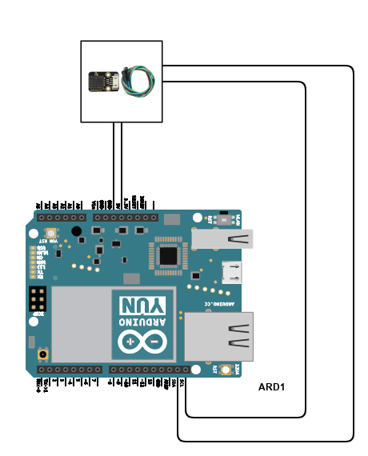

# IoT-Lab3 (Sophia Canja & Sovial Sonzeu)

## Youtube link to demo
https://www.youtube.com/watch?v=ZBvzylDcxw4&ab_channel=Sovi

## Overview of Lab 3
The goal of the lab is to connect the TTGO to a Wi-Fi source and connect to a webpage that is hosted on an AWS instance. From there, the temperature and humidity values that are passed in will be displayed on the server console. In order to get the temperature and humidity values, the DHT20 sensor is used. We connected it to the TTGO and read the values using the DHT20 header file.

## Files Changed
The files that were changed are the main.cpp in the src folder file and the platform.ini file. 

## Wiring Diagram (different hardware, same result)

